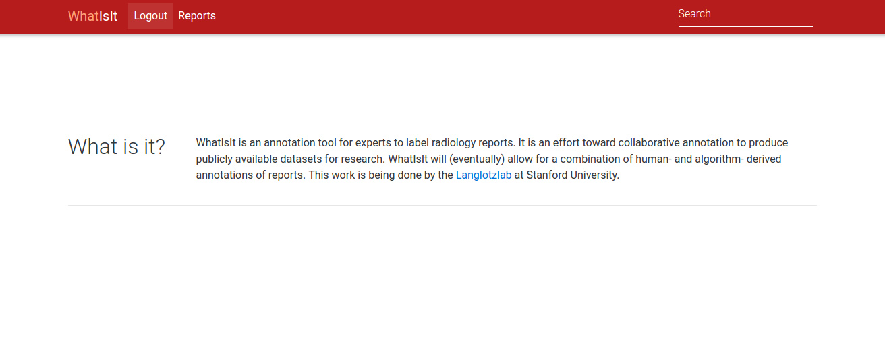

# Whatisit

**under development**

This will be the start of (some) collaborative annotation interface for de-identified radiologist reports.

## Development

You will want to [install Docker](https://docs.docker.com/engine/installation/) and [docker-compose](https://docs.docker.com/compose/install/) and then build the image locally:

      docker build -t vanessa/whatisit .

Then start the application:

      docker-compose up -d

